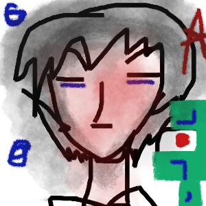

# **OmiDot**

  

## Features

- **Fork of Godot engine**: In case my country get sanction and so i can continue to use the engine
- **For Commercial, Archivial and personal projects**: I want to continue the project and can inspite if the license changes and my country gets sanction
- **To learn programming and experiment with the engine **:   i want to get good at programming . -dont expect a stable product as i will expermient on it
-**For reasearch purposes**:  

- <span style="color: green;**Adding custom modification and astehtics**: I want to add my own features to the engine to focus it on codeless if i get good at programming
-<span style="color: purple; I dont know how to change logo

#**original readme:**
#Its a fork of  Godot Engine
## Platforms
- **Supported Platforms**: Windows and Linux only. 

## a fork of godot 2D and 3D cross-platform game engine

**Fork of [Godot Engine](https://godotengine.org) is a 
game engine to create 2D and 3D games ** [consoles](https://docs.godotengine.org/en/latest/tutorials/platform/consoles.html).

## Free, open source and community-driven

omidot is   free and open source under   [MIT license](https://godotengine.org/license).
No strings attached, no royalties, nothing. The users' games are theirs, down
to the last line of engine code

Before being open sourced in [February 2014](https://github.com/godotengine/godot/commit/0b806ee0fc9097fa7bda7ac0109191c9c5e0a1ac),
Godot had been developed by [Juan Linietsky](https://github.com/reduz) and
[Ariel Manzur](https://github.com/punto-) (both still maintaining the project)
for several years as an in-house engine, used to publish several work-for-hire
titles.
## Documentation and Stability
For detailed information and guidance, please refer to the [Godot 4.3 Documentation](([https://docs.godotengine.org](https://docs.godotengine.org/en/stable/)). Our unstable branches use Godot 4.4 Dev Beta 3, for which the [Godot 4.4 Documentation]((https://docs.godotengine.org) is relevant.
## Documentation and Demos
For comprehensive guidance and detailed information, please refer to the [official Godot 4.3 documentatio on Read the Docs. This documentation is meticulously maintained by the Godot community and can be found in their own [GitHub repository](https://github.com/godotengine/godot-docs).

## Getting the engine
### Binary Downloads
Currently, the main executable build for OmiDot is not available. Users can compile the engine from source. 
### Export Templates
To export your projects for various platforms, you will need the Godot export templates. These can be downloaded from the [Godot website](https://godotengine.org/download).

the export templates for Godot editor can be found [on the Godot website](https://godotengine.org/download).

### Compiling from Source
For detailed instructions on compiling the engine from source, please refer to the [official Godot documentation](https://docs.godotengine.org/en/latest/contributing/development/compiling).

